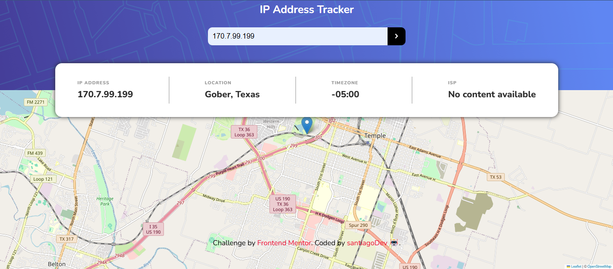

# Frontend Mentor - IP address tracker solution

This is a solution to the [IP address tracker challenge on Frontend Mentor](https://www.frontendmentor.io/challenges/ip-address-tracker-I8-0yYAH0). Frontend Mentor challenges help you improve your coding skills by building realistic projects. 

## Table of contents

- [Overview](#overview)
  - [The challenge](#the-challenge)
  - [Screenshot](#screenshot)
  - [Links](#links)
- [My process](#my-process)
  - [Built with](#built-with)
  - [What I learned](#what-i-learned)
  - [Continued development](#continued-development)
  - [Useful resources](#useful-resources)
- [Author](#author)
- [Acknowledgments](#acknowledgments)

## Overview

This is an ip address tracker that gives your aproximately location based on your isp.

### The challenge

Users should be able to:

- View the optimal layout for each page depending on their device's screen size
- See hover states for all interactive elements on the page
- See their own IP address on the map on the initial page load
- Search for any IP addresses or domains and see the key information and location

### Screenshot

### Links

- Solution URL: [Click here](https://github.com/santiagodev10/IP-Address-Tracker/tree/main)
- Live Site URL: [Click here](https://ip-address-tracker-chg4b55ms-santiago-s-projects-57b87035.vercel.app/)

## My process

### Built with

- Semantic HTML5 markup
- CSS custom properties
- Flexbox
- CSS Grid
- Mobile-first workflow
- Fetch
- ES6 Modules

### What I learned

I learned more about API calls using fetch.

### Continued development

Consuming APIs is something very common in the world of web development, so i want to keep mastering the different ways to fetch data from an API, along with the options that might have the documentation.

## Author

- Frontend Mentor - [@santiagodev10](https://www.frontendmentor.io/profile/santiagodev10)
- Twitter - [@santiagoDev10](https://x.com/santiagoDev10)